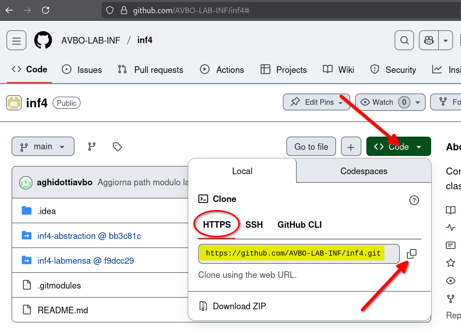
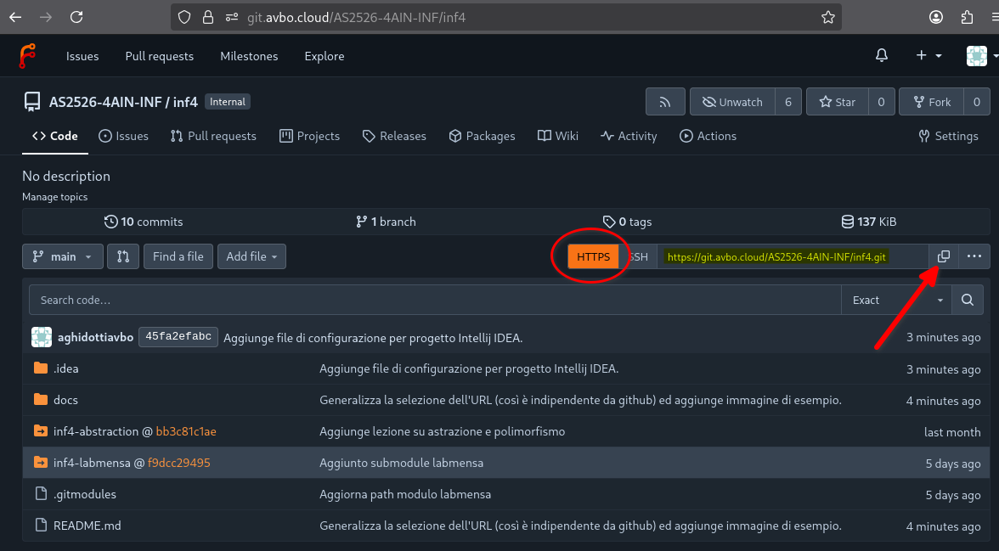

# Lezioni e laboratorio di Informatica - Classe 4

## Introduzione

- Per clonare il repository e tutti i relativi moduli

```bash
git clone --recurse-submodules https://ORGANIZATION_URL/inf4.git
```
dove **ORGANIZATION_URL** si può ottenere accedendo al repository da interfaccia web:




(e.g. https://**github.com/AVBO-LAB-INF**/inf4.git).
- Per aggiornare la copia locale del repository e di tutti i relativi moduli dopo un aggiornamento

```bash
git submodule update --init --recursive
```
